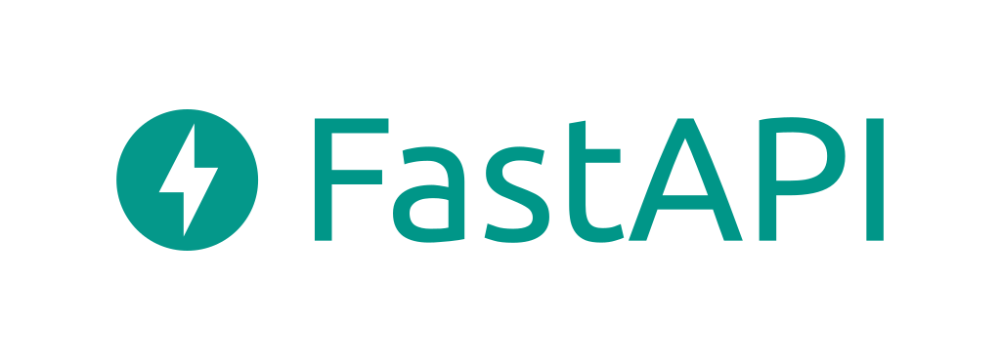

  
  <h1>
    Привет! Я backend разработчик из дождливого города - Санкт-Петербург
  </h1>
  <h3>
    About Me
  </h3>
  

    Как я уже написал, меня зовут Сергей. Мне 17 лет и я хочу развиваться в web разработке, backend в том числе.
  

  <h3>
    - а что у тебя по стеку?
  </h3>
  <h3>
    - классика жанра
  </h3>
  
  
  
  
  
  <h3>
    Как со мной связаться?
  </h3>
    
    

